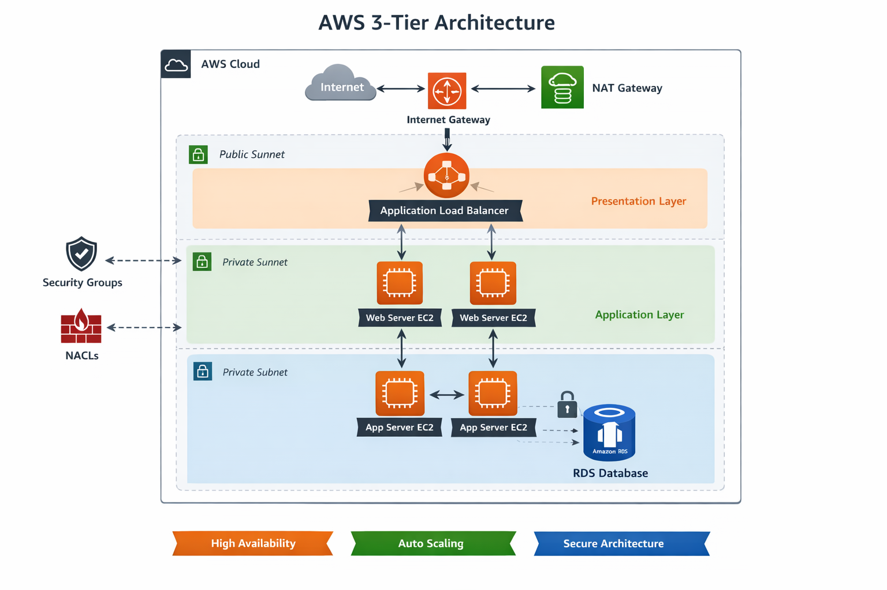

# 🚀 AWS 3-Tier Architecture Project

## 📌 Project Overview
This project demonstrates the design and deployment of a **scalable, secure, and highly available 3-tier architecture** on Amazon Web Services (AWS).  

The architecture follows industry best practices by separating the application into three layers:
- **Presentation Layer (Web)**
- **Application Layer**
- **Database Layer**

---

## 🏗️ Architecture Diagram

---

## ⚙️ AWS Services Used
- **VPC (Virtual Private Cloud)** – Network isolation
- **Subnets** – Public and Private segmentation
- **Internet Gateway** – Internet access for public resources
- **NAT Gateway** – Secure outbound internet for private instances
- **EC2 (Elastic Compute Cloud)** – Hosting web & application servers
- **Application Load Balancer (ALB)** – Traffic distribution
- **Auto Scaling Group** – High availability and scalability
- **RDS (Relational Database Service)** – Managed database
- **Security Groups & NACLs** – Network security
- **IAM** – Access management
- **CloudWatch** – Monitoring and logging

---

## 🧱 Architecture Breakdown

### 🌐 1. Web Tier (Presentation Layer)
- Hosted on **EC2 instances** in public subnets  
- Receives traffic from users  
- Connected to **Application Load Balancer (ALB)**  

### ⚙️ 2. Application Tier
- Hosted on EC2 instances in **private subnets**  
- Processes business logic  
- Not directly accessible from the internet  

### 🗄️ 3. Database Tier
- Uses **Amazon RDS** in private subnet  
- Stores application data securely  
- Accessible only from application layer  

---

## 🔐 Security Implementation
- Public access restricted using **Security Groups**
- Database placed in **private subnet**
- Controlled communication between tiers
- **No direct SSH access** to private instances (optional bastion host setup)

---

## 🚀 Deployment Steps

1. Create a **VPC**
2. Configure **Public and Private Subnets**
3. Attach **Internet Gateway**
4. Setup **NAT Gateway**
5. Launch **EC2 instances** for Web & App tiers
6. Configure **Application Load Balancer**
7. Setup **Auto Scaling Group**
8. Launch **RDS instance** in private subnet
9. Configure **Security Groups**
10. Deploy sample application

---

## 📸 Implementation Details

### 🔹 VPC Setup
Created a custom VPC with public and private subnets across multiple availability zones.

### 🔹 EC2 Instances
Launched EC2 instances for web and application layers with proper security group configurations.

### 🔹 Load Balancer
Configured an Application Load Balancer (ALB) to distribute incoming traffic across web servers.

### 🔹 RDS Database
Deployed Amazon RDS in a private subnet to ensure secure database access.

### 🔹 Application Output
Successfully hosted a sample web application and verified traffic routing through ALB.

---

## ✅ Project Outcome
- Successfully deployed a **highly available web application**
- Achieved **fault tolerance using Auto Scaling**
- Ensured **secure communication between tiers**
- Implemented **real-world cloud architecture design**

---

## 💡 Key Learnings
- Designing secure AWS architectures  
- Working with VPC and subnetting  
- Load balancing and auto scaling  
- Database deployment in private networks  
- Implementing best security practices  

---
